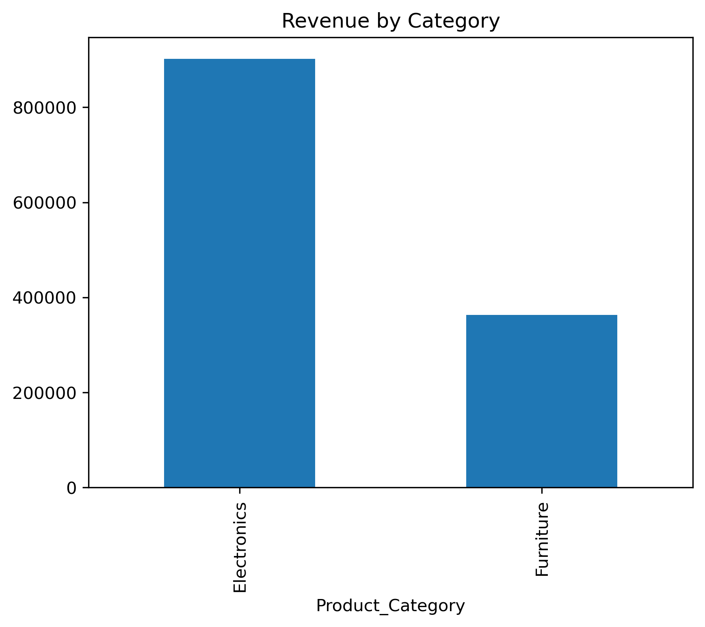
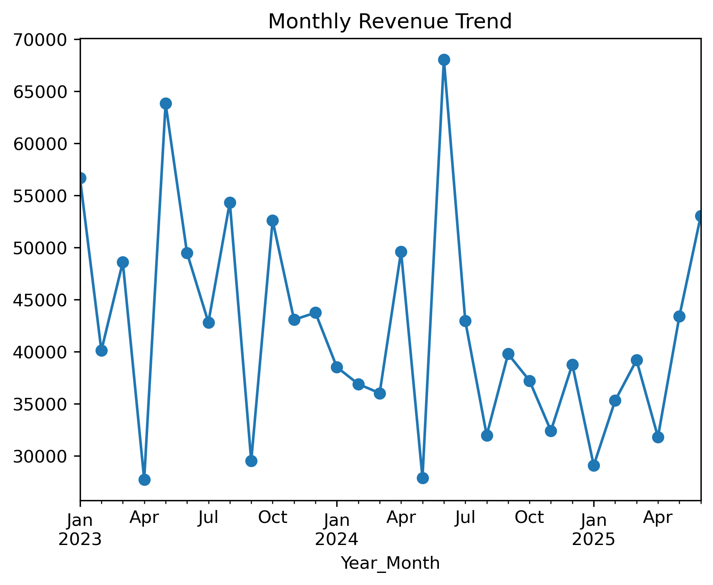

# E-Commerce Sales Analysis - Exploratory Data Analysis (EDA)

## Project Overview

This project performs Exploratory Data Analysis (EDA) on an e-commerce transactional dataset to identify sales trends, customer behaviour, product performance and revenue drivers.

The objective was to transform raw order data into meaningful business insights that can support decision-making.

---

# Dataset Overview

The analysis is performed on the cleaned dataset created during Week 1.

Dataset Size:

- Rows: 1200 Orders
- Columns: 16 Analytical Columns

Dataset Grain:

Each row represents a single customer order transaction.

Primary Key:

OrderID

---
# Business Questions Answered

This analysis focuses on:

- Which products generate the highest revenue?
- Which categories contribute most to sales?
- What payment methods are preferred?
- How effective are discounts?
- What percentage of orders are completed successfully?
- Which customers contribute the most revenue?

---

# Tools Used

- Python
- Pandas
- Matplotlib
- Seaborn
- Jupyter Notebook

---

# Analysis Performed

##  Revenue Performance

Key findings:

- Average Order Value: ₹1053.97
- Electronics generated ~71% of total revenue.
- Furniture contributed ~29% of revenue.

Meaning:

The business is heavily dependent on electronics sales, so inventory and marketing strategies should prioritize this category.

---

## Product Performance

Top revenue generating products:

1. Chair
2. Printer
3. Laptop

Meaning:

These products are the strongest revenue contributors and should receive priority in stock planning.

---

## Customer Behaviour

Customer analysis showed:

- Revenue contribution varies significantly across customers.
- A smaller group of customers contributes higher revenue.

Future improvement:

Customer segmentation using RFM analysis can identify VIP and loyal customers.

---

## Order Performance

Order lifecycle analysis:

- Delivered orders represent successful transactions.
- Cancelled and returned orders represent potential revenue loss.

Business focus:

Improve fulfillment process and reduce failed orders.

---

## Discount Impact

Discount analysis showed:

- Discounted orders generated higher total revenue.
- Average order value was slightly higher for discounted transactions.

Business focus:

Optimize discounts based on revenue impact rather than only increasing order volume.

---
# Visualizations

The project includes:

### Category Revenue Analysis

### Order Status Analysis

### Monthly Revenue Trend Analysis

---

